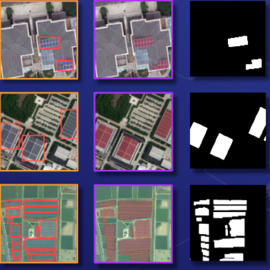

## 🌐 Deep-Learning-for-Solar-Panel-Recognition
🌍 Recognition of photovoltaic cells in aerial images with **Convolutional Neural Networks** (CNNs).
**Object detection** with YOLOv5 
**image segmentation** with Unet++


## 💽 Installation 
Create a **Python 3.8** virtual environment and run the following command:

```
conda create -n panel python=3.8 -y
```
```
conda activate panel
```
```
pip install -r requirements.txt 

```
```
pip install torch torchvision --extra-index-url https://download.pytorch.org/whl/cu113

```
## 🔍 Data sources

-----------
* ### ☀ Solar Panels Dataset
    _Multi-resolution dataset for photovoltaic panel segmentation from satellite and aerial imagery_ (https://zenodo.org/record/5171712)
 

## 💻 How to start?

------------
### OBJECT DETECTION
1. Specify the location of the data in [sp_dataset.yaml](src/models/yolo/sp_dataset.yaml).
2. Preprocess and generate annotations with [yolo_preprocess_data.py](src/features/yolo_preprocess_data.py) and [create_yolo_annotations.py](src/features/create_yolo_annotations.py) respectively.
3. Run [yolo_train.py](src/models/yolo_train.py) for training. 
4. Run [yolo_detect.py](src/models/yolo_detect.py) for inference.

### SEGMENTATION
1. Specify the structure of the data in [segmentation/datasets.py](src/models/segmentation/datasets.py)
2. The code to train and run segmentation models can be found in the [notebooks section](notebooks).

## 📡 Inference
```
# After all the above steps have been completed 

python app.py

```
## 🛠 Web App
```
# Add images to web app on local or server
# Total number of panels 
# Total area of the panels 

```

## 🧪 Models
-----------
* ### Object Detection
  * **YOLOv5-S:** 

* ### Image Segmentation
  * **Unet++:** 

## 📈 Results


---------------


